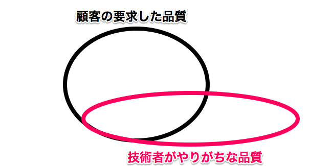

## この資料について
2013/12に行ったNODE-Setagaya＃7という勉強会でテキストベタ書きで発表した内容をスライドにまとめました。当初予定していたクラウドソーシングの話より、前日社内勉強会で学んでテキストに書き下したPMBOKの話の方がウケてしまい若干複雑な気持ちではありますが、こちらは資料として公開しても問題なさそうなのでまとめました。  

勉強会前日に学んだ内容を書き下してまとめたものなので、そういうものがあるんだなー程度で見ていただければと思います。内容について何かありましたらFacebook経由で連絡いただければと思いますm(_ _)m

* Facebook  
https://www.facebook.com/takao.fukui.121

--- .class #id 

## PMBOKとは

* プロジェクトマネジメント協会が発行する、「プロジェクトマネジメント知識体系ガイド」
* どうやってプロジェクトを成功させるかの考え方、ノウハウを学ぶことができる  
  -> 知ることをとっかかりにして自分で調べ、自分で考えるための力をつける
* 成功の秘訣ではない  
  -> 当たり前の事が書かれている  
  -> 「リスク」と「インシデント」など混同されがちな言葉が明確に分けられている

(WikiPedia、社内勉強会)  

--- .class #id 

## システム開発プロジェクトの特性

* 短納期
* あいまい
* 生産性にばらつき  

※ ゴールが定まらないままスタートし、リリースした時に最新のシステムである必要がある  
-> 激動の現代では、従来のウォーターフォールで納期が長い開発は難しくなりつつある  

### 参考
インクリメンタル開発とイテレーション開発  
http://d.hatena.ne.jp/incarose86/20121117/1353144430

--- .class #id 

## 品質

* 後ろ向き品質  
 -> バグをテストで潰すなど、満たしていて当然の品質  
* 前向き品質  
 -> 高機能なシステム  
* 感性品質  
 -> 答えは無いが、何かすごい品質(例:ユーザー・エクスペリエンス)  

※ 日本のIT業界は後ろ向き品質に着目することは多いが前向きや感性品質は気にしないことが多い

* QA  
制作しているシステムの品質を高める  
-> 過剰品質になったり、必要のない機能が盛り込まれる可能性がある(職人)  
* QC  
顧客の要求を満たしているか、過剰品質になっていないか確認する(PM)  
-> 余計な機能が組み込まれていないかチェック  
-> 不要に要求を広げさせない。要求を満たしたら一旦閉める  

--- .class #id 

※ 顧客満足とはQCDのこと。顧客の求める品質、コスト、納期を満たすこと  
-> 技術者が求めている品質と顧客が求めている品質は異なることが多いので注意  
※ スコープを明確にする  

※ 品質は検査ではなく作りこみで上げる  
-> 検査は作成されたモノを厳選しているという作業。成果物の品質を上げるための作業ではない  

--- .class #id 
## リスクマネジメント

※ リスクマネジメントは特殊なマネジメント  
-> 対策するほどコストは高くなるが、対策をしたから確実にトラブルを防げるわけではない  
-> 対策しなくても何も問題が起こらない事もある

### 言葉について

* リスク  
プロジェクトに影響を与える潜在的要因  

* インシデント  
問題が発生したが比較的影響の無いもの  

* トラブル  
インシデントのうち、影響が顕在化したもの  

--- .class #id 
|リスクマネジメント|トラブル|影響|
|---|---|---|
|する|起きる|ある|
|しない|起きない|ない|  
  
しない -> 起きない -> ない :ラッキー。でも特に顧客から評価されるわけではない  
しない -> 起きる -> ない :内々で対策しておこう。顧客から評価が特にあるわけではない  
しない -> 起きる -> ある :なんで対策しておかないの？顧客からの評価が下がる  

する -> 起きない -> ない :対策してたから当たり前だね  
する -> 起きる -> ない :対策してたのに。。もっと対策をねりなおさないといけないね  
する -> 起きる -> ある :高い金払ってリスク対策しておきながら何やってんの？  

※ リスク対策をやって評価が上がる事はあまり無いが、トラブルが発生した場合大変  

--- .class #id 

終わりですm(_ _)m  

### CM

徳島県の実家でさつまいも(なると金時)の直販を始めました。  

### Twitter  
https://twitter.com/fukuimo2013  

### お店パンフレット(PDFファイル)  
https://t.co/gr7IBJJP9U  

農業 × IT、六次産業化などに興味ある方、情報交換しましょう!! (>_<)/
